<h1>
  
  
  
REDCap

</h1>

Welcome to the UCSF Epilepsy REDCap database documentation! We hope that you will be able to find help in these pages. This guide is organized in the following different sections: 

1. [Navigating the database](#navigation), to learn how to use the interface of the database and how it is organized.
2. [General information](#general), section of the database used by everyone.
3. [Epilepsy](#epilepsy), section of the database for information about epilepsy.
4. [RNS](#rns), section of the database for information about RNS.
5. [Neurodiagnostics](#ndx), section of the database for information useful to the neurodiagnostics department.
6. [Help](#help) describes how to get help beyond this guide.

Everyone should start by getting familiar with the [general information](#general) section. One should then consult the section associated with the data they need to enter/consult into the database. If that is not sufficient, one should consult the [help](#help) section to learn how to get further guidance.

## Navigating the database 
When you login to [redcap.ucsf.edu](https://redcap.ucsf.edu/), you will see a list of projects you are a part of.
- If you do not see that, you can click on the `My Projects` tab on the top left to get back to the list of projects, as shown here.

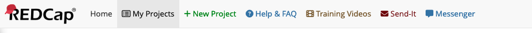

Choose the project `UCSF Epilepsy` -- this contains the database.

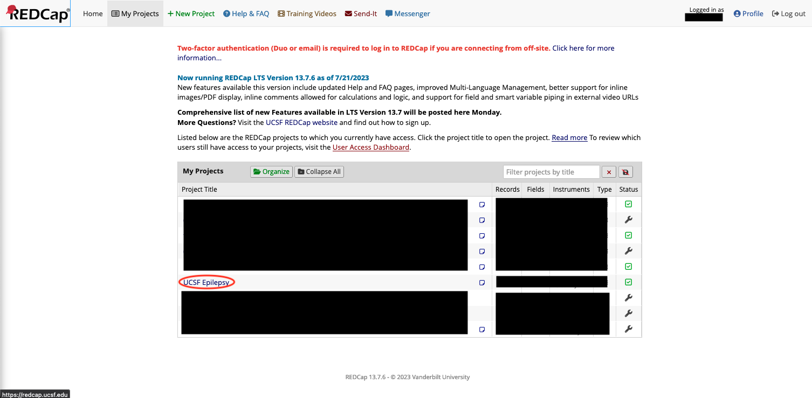

If you want to add, search, or consult patient data, you can click on the `Add/Edit Records` tab on the left side, as shown below.

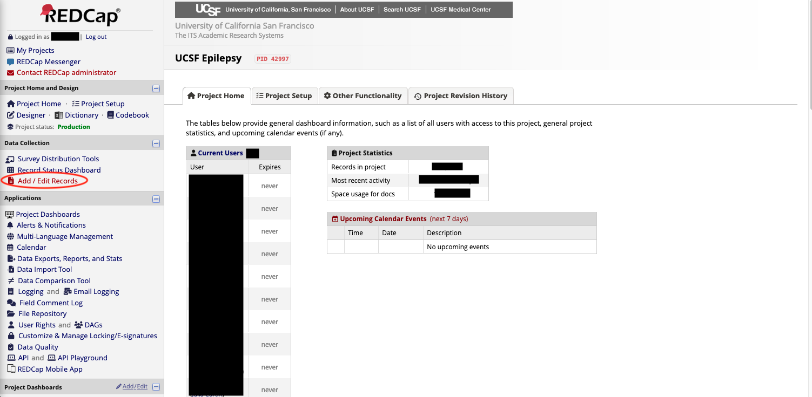

TO ADD A PATIENT: You will see a green `Add new record` button, which you can use to add new patients.

TO SEARCH: You will also see a search box where you can search for an individual patients or multiple based on criteria. 

The full page is shown below.

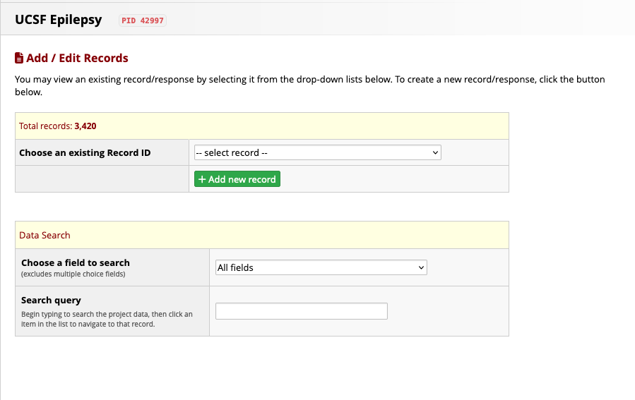

To find an individual patient search for their name, like so:

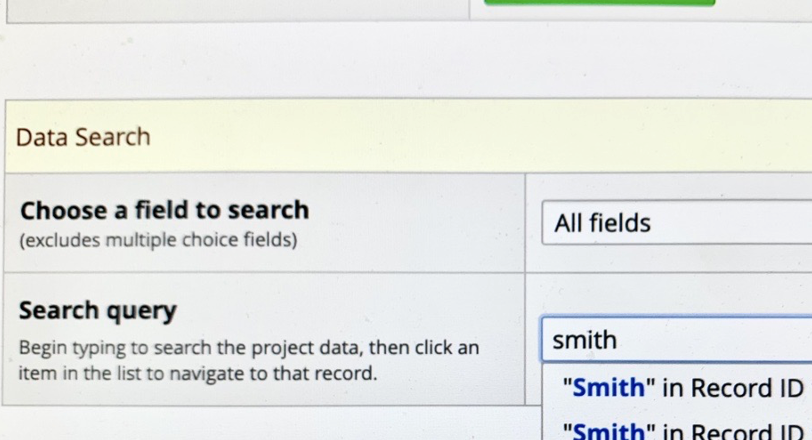

You should now be on the chosen patient's main page. It should look something like the following, perhaps with less content depending on your role or on the particular patient.

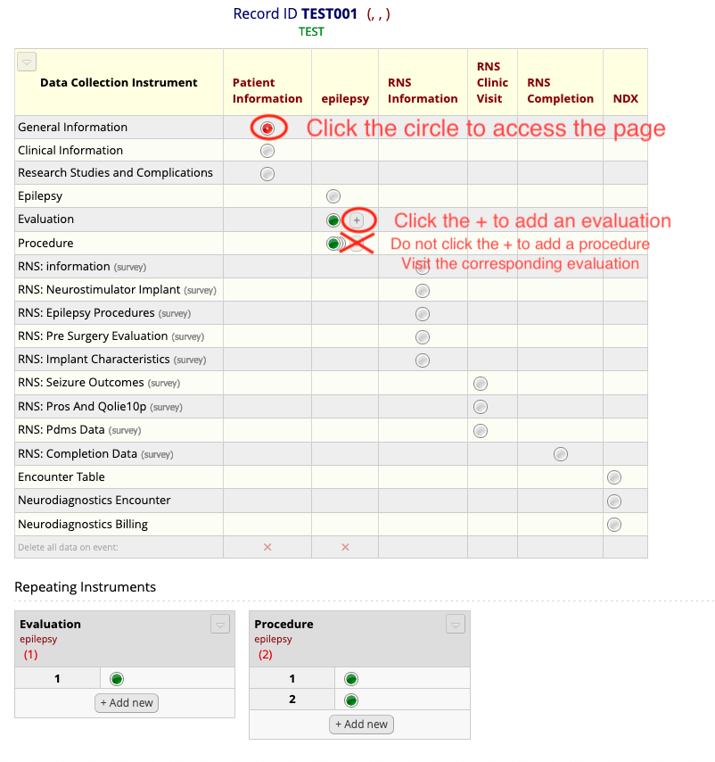

If one wants to go back to the main page of the record, one can click on the `Record ID XX` (where `XX` is the ID of the patient) tab on the left side to access the main page of the patient, as shown below.

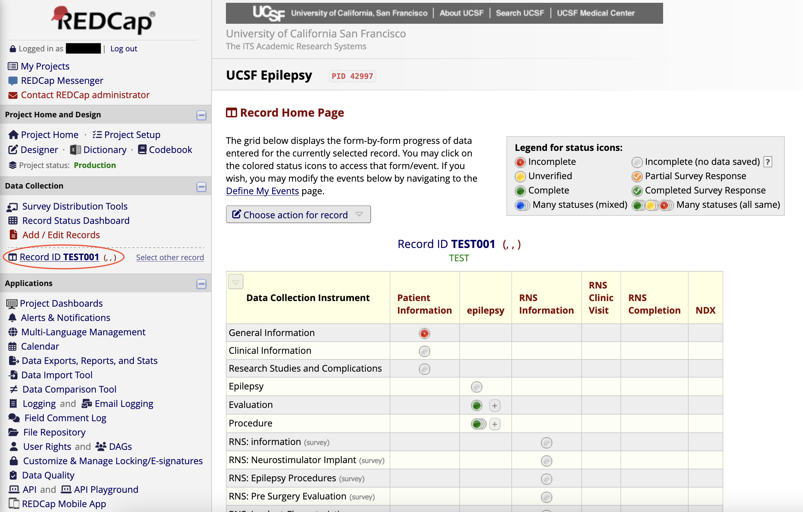

One can then choose the section that they wish to consult or edit and click on the corresponding circle. You can then see the data, and modify it if you so wish. Don't forget to click the save button after modifying anything. 

## General Information 
This is likely the first section every user of the database will encounter. It contains the basic information about the patient, their name, mrn, etc. It is the first section that comes about when creating a new patient. One thing to note, it is impossible to create a new record with the same mrn as a record that is already present in the database. If you see an error about this, you can go back to the `Add/Edit Records` tab to search the patient and modify the information if needed. After you are done modifying the data, you can click on the `Save and Continue` button.

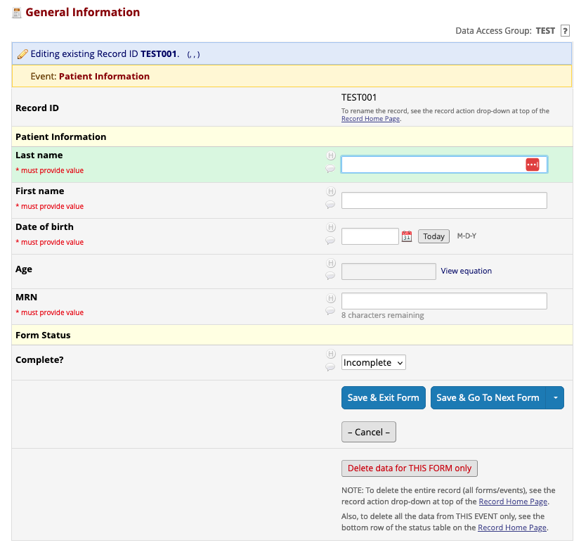

The next form will differ depending on your role. If you are a member of the neurodiagnostics unit, please check out the [neurodiagnostics](#ndx) section. Otherwise, you can check out the [Epilepsy](#epilepsy) section. 

## Epilepsy 
The following sections are relevant for members of the epilepsy division that are not part of the neurodiagnostics unit and who are not wishing to enter data pertaining to the RNS procedures. They are listed in the same order as they are in the database:

- `Clinical information`, which contains more information about the patient that is relevant clinically but that does not specifically pertain to epilepsy.
- `Research Studies and Complications`, which contains information about the research studies the patient is a part of as well as the complications from which they suffer.
- `Epilepsy`, which contains information pertaining to the epilepsy condition of the patient, if appropriate.
- [`Evaluation`](#eval), which contains information about the different pre-surgery evaluations that the patient has undergone.
- [`Procedure`](#proc), which contains information about the different procedures that compose said surgery evaluations.

The last two sections are sections that can happen multiple times for the same patient. We will go into more detail in the following subsections.

### Evaluation 
This section contains a table listing all the procedures associated with the pre-surgery evaluation, as well as some other fields describing the evaluation. You can create a new evaluation by clicking the circle in the main page of the record (click on the `Record ID XXX` tab on the left side panel to get back to that) if it is the first one to be created, or by clicking the `+` button next to the circle if not. You can choose which `Evaluation` to consult from the drop down at the top left of the `Evaluation` page, or at the bottom of the main page of the record. One thing to keep in mind: there is a big `Add new` button under the table of procedures. This should be the only means by which you add `Procedure` forms to the evaluation, since it is the only way to link the `Procedure` to the specific `Evaluation` it is meant for.

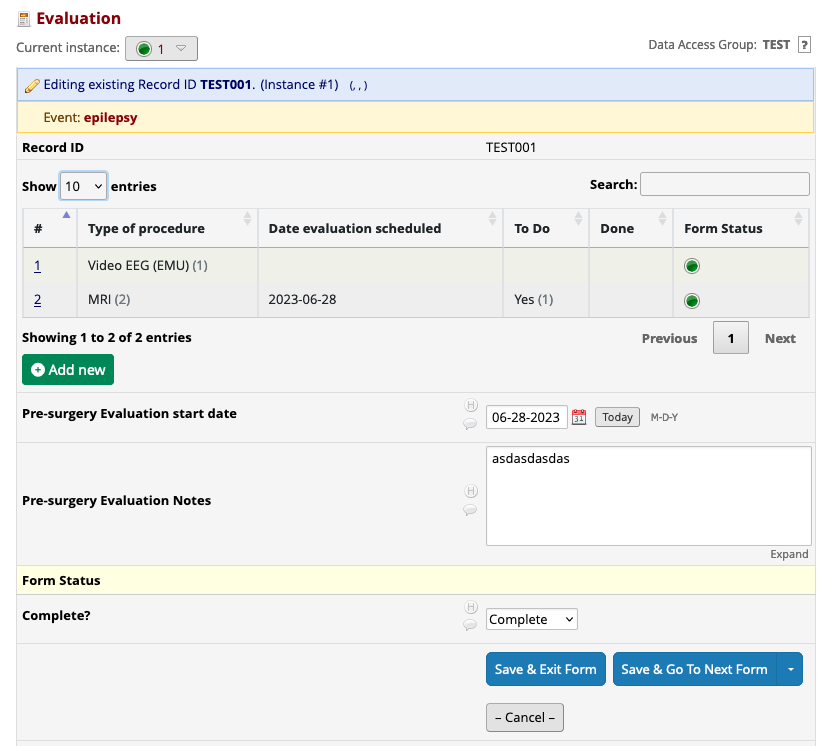

### Procedure 
This section details the different procedures that make up a pre surgery evaluation. You can select the type of procedure from the `Type of procedure` dropdown, and fields related to that type of procedure will appear. Please note, you should only create procedure forms using the `Add new` button of the table of procedures within the `Evaluation` you want to link the `Procedure` to, as described in the previous section. Otherwise, you can fill out this section as you normally would.

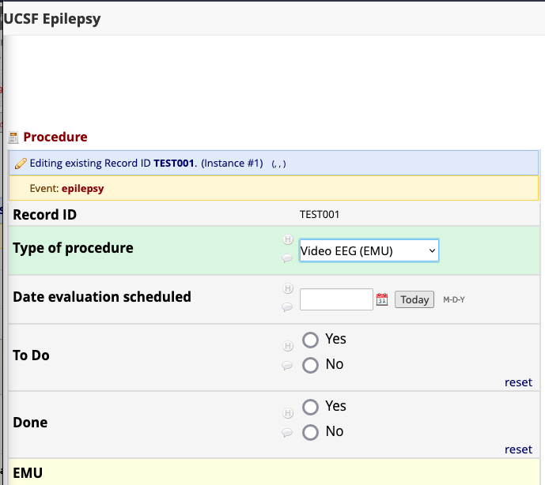

## RNS
The RNS-focused part of the database contains many sections that have been adapted from the database created by Vikram. No big change was made save for the relocation of some of the fields to the [General Information](#general) or [Epilepsy](#epilepsy) sections. You can fill them out in the same manner you would other sections.

## Neurodiagnostics 
The `Neurodiagnostics` part of the database is comprised of three sections: 

- `Encounter Table`, which is just a table listing all the different encounters a patient has had.
- [`Neurodiagnostics Encounter`](#enc), which contains details about a specific encounter.
- [`Neurodiagnostics Billing`](#billing), which contains details about the billing for each day of an encounter. Most users will not have to interact with the billing section and will not even see it.

The last two sections are sections that can happen multiple times for a particular patient, and we will go into more detail about that in the following subsections.

### `Neurodiagnostics Encounter` 
This section is meant to contain information about a patient's `Encounter` at the hospital. It is used by the neurodiagnostics unit, and can be consulted by other people as well. One patient can have many encounters, so this page can be created multiple time. One can create a new `Encounter` by clicking the circle in the main page of the record (click on the `Record ID XXX` tab on the left side panel to get back to that) if it is the first one to be created, or by clicking the `+` button next to the circle if not. One can choose which `Encounter` to consult from the drop down at the top left of the `Encounter` page, or at the bottom of the main page of the record.

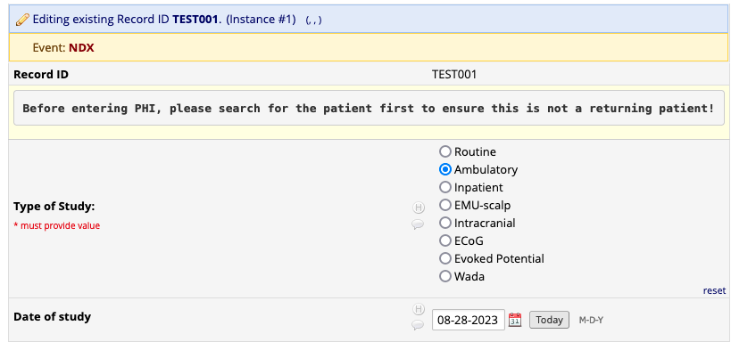

One thing to keep in mind for those who enter billing: there is a big `Add new` button under the table of billing days within each `Encounter`. This should be the only means by which you add `Billing` forms to the evaluation, since it is the only way to link the `Billing` to the specific `Encounter` it is meant for.

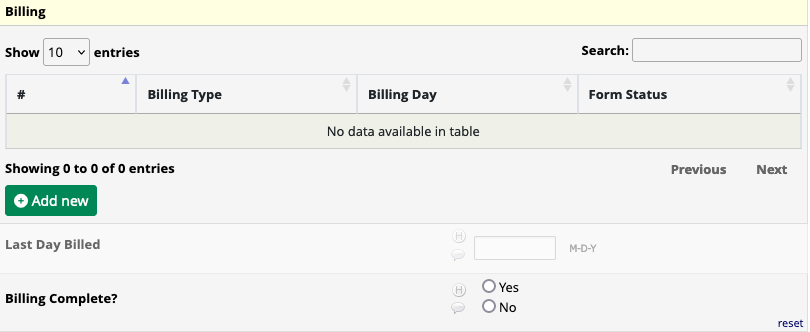

### `Neurodiagnostics Billing` 
This form will only be used by select people within the neurodiagnostics unit. It allows them to keep track of which days have been billed for which encounter. Please note, you should only create billing forms using the `Add new` button of the table of procedures within the `Encounter` you want to link the `Billing` to, as described in the previous section. Otherwise, you can fill out this section as you normally would.

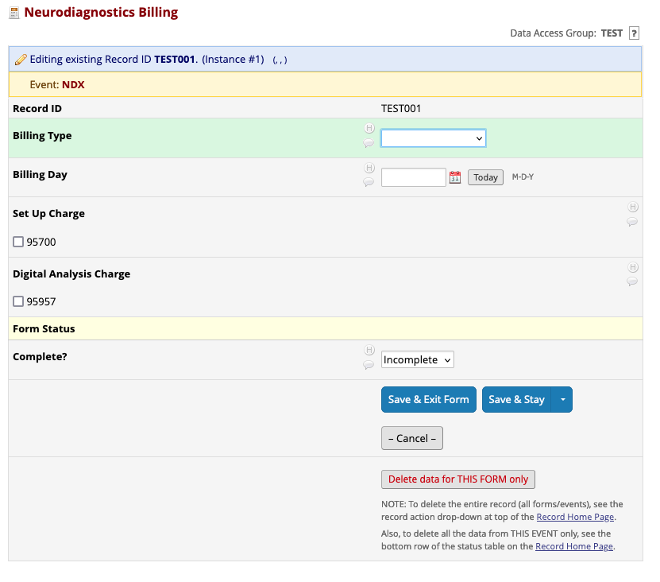

## Help

If you are interested in creating RedCAP reports, you might find [this document](https://cri.uchicago.edu/wp-content/uploads/2015/12/REDCap-Reports-and-Exports.pdf) useful.

If you are looking for more information about RedCAP itself and how to use the web interface, you might find [this document](https://www.unmc.edu/vcr/_documents/unmc_redcap_usage.pdf) useful. There are also many instructional materials on the [REDCap website](https://redcap.ucsf.edu/) itself, under the `Help & FAQ` and `Video Tutorials` tabs.

If you need more help, for example if you uncover a bug or if you need some fields to be added to the database, you can contact [Raphaël Christin](mailto:raphael.christin@ucsf.edu?subject=[RedCAP%20Epilepsy]%20Question). 
